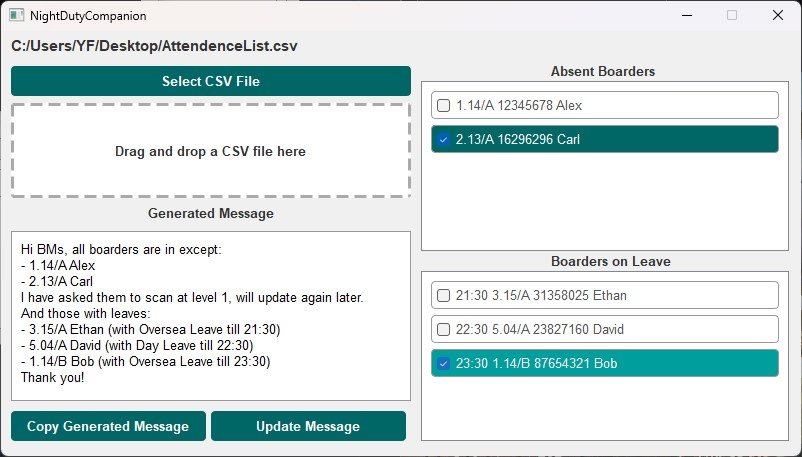

NightDutyCompanion is a simple desktop application designed to assist RIB RAs with RIB routine night duty.

##  User Guide

### Step 1: Export Attendance Data from BMS

1. Login to the BMS (Boarding Management System).
2. Navigate to the Attendant Listing section.
3. Look for the button to export today's attendance data
   
   
   
4. Click the export button to initiate the download of today's attendance list in .xls format.
   
   
   
   The download will start shortly, and you will have the attendance list saved as a .xls file.

### Step 2: Fixing Corrupted Format Issues

1. Open the downloaded .xls file with Microsoft Excel.
2. You may encounter an error stating that the file is in a different format than specified by the file extension.
   
   
   
3. Click the "Yes" button to open the file anyway.
4. In Excel, click the "File" option in the menu bar.
5. Select "Save As..." to save the file as a .csv (Comma Separated Values) file.
   
   
   
   Saving it as a .csv file helps fix any corrupted format issues.

### Step 3: Running NightDutyCompanion

1. Run the NightDutyCompanion.exe program. A window will appear.
   
   
   
2. Upload the .csv file by either clicking the "Select CSV File" button and selecting the file, or simply dragging and dropping the file into the window.

### Step 4: Analyzing Attendance Data

1. Once the .csv file is uploaded, NightDutyCompanion will automatically analyze the attendance data.
2. The analysis result will be displayed in the window.
   
   
   
   

### Step 5: Copying Generated Message

1. You can directly copy the generated message by clicking the "Copy Generated Message" button.
2. The message will be copied to your clipboard for easy pasting.
3. The Generated Message sections in NightDutyCompanion is editable. Feel free to make any necessary edits to the text as needed.

### Step 6: Check the Absent Boarders and Boarders on Leave

1. You can use the two checkbox lists on the right side of the app to keep track of the boarders' status.
2. When a absent or on-leave boarder is back, check the corresponding box to mark them as such. will be highlighted in green, providing better visualization.

## More to Come

1. Auto Fix Corrupted XLS Files: NightDutyCompanion will introduce an automatic file format fixing feature. Instead of manually saving the downloaded XLS file as a CSV, the application will handle the conversion process internally, ensuring that any corrupted format issues are resolved seamlessly.
2. Further UI Beautification: NightDutyCompanion will undergo further UI enhancement to improve the overall visual appeal and user experience. The updated user interface will be more intuitive, user-friendly, and aesthetically pleasing, making it even easier to navigate and use the application effectively.
3. And more … 

## Disclaimer

Please note that this project has not undergone rigorous testing and may contain potential bugs and feature flaws. If you encounter any issues or have suggestions for improvements, please kindly contact me or simply raise an issue in the IssueTracker of this Repo. Thank you for your understanding!

Enjoy!
