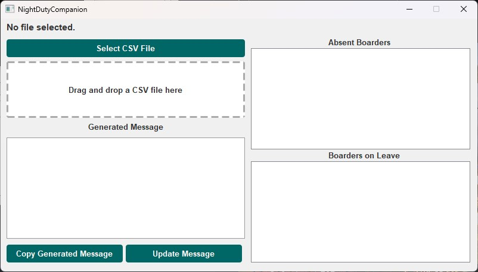

# NightDutyCompanion User Guide 🌙

## Step 1: Export Attendance Data from BMS 📊

1. Log in to the BMS (Boarding Management System).
2. Navigate to the Attendant Listing section.
3. Look for the button to export today's attendance data.

   

     
   

4. Click the export button to initiate the download of today's attendance list in `.xls` format.

   

     
   

The download will start shortly, and you will have the attendance list saved as a `.xls` file.

## Step 2: Fixing Corrupted Format Issues 🛠️

1. Open the downloaded `.xls` file with Microsoft Excel.
2. You may encounter an error stating that the file is in a different format than specified by the file extension.

   :exclamation: **Error**: "The file format and extension of 'filename.xls' don't match. The file could be corrupted or unsafe."

3. Click the "Yes" button to open the file anyway.
4. In Excel, click the `File` option in the menu bar.
5. Select `Save As...` to save the file as a `.csv` (Comma Separated Values) file.

   

     
   

Saving it as a `.csv` file helps fix any corrupted format issues.

## Step 3: Running NightDutyCompanion 🚀

1. Run the `NightDutyCompanion.exe` program. A window will appear.

   

     
   

2. Upload the `.csv` file by either clicking the `Select CSV File` button and selecting the file, or simply dragging and dropping the file into the window.

## Step 4: Analyzing Attendance Data 📊

1. Once the `.csv` file is uploaded, NightDutyCompanion will automatically analyze the attendance data.
2. The analysis result will be displayed in the window.

   

     
   

## Step 5: Copying Generated Message 📋

1. You can directly copy the generated message by clicking the `Copy Generated Message` button.
2. The message will be copied to your clipboard for easy pasting.
3. The `Generated Message` section in NightDutyCompanion is editable. Feel free to make any necessary changes to the text as needed.

## Step 6: Check the Absent Boarders and Boarders on Leave ☑️

1. You can use the two checkbox lists on the right side of the app to keep track of the boarders' status.
2. When an absent or on-leave boarder is back, check the corresponding box to mark them as such. They will be highlighted in green, providing better visualization.

## Step 7: Update the Message with the Latest Status from the Checkbox Lists 🔃

1. When you want to update the BMs with the latest status of the boarders, simply click the `Update Message` button.
2. The message will be updated with the boarders who are still absent or on leave, based on the status of the checkbox lists.
3. The message can be copied again by clicking the `Copy Generated Message` button.

   

     
   

## More to Come 💡

1. Auto Fix Corrupted XLS Files: NightDutyCompanion will introduce an automatic file format fixing feature. Instead of manually saving the downloaded XLS file as a CSV, the application will handle the conversion process internally, ensuring that any corrupted format issues are resolved seamlessly.
2. Further UI Beautification: NightDutyCompanion will undergo further UI enhancement to improve the overall visual appeal and user experience. The updated user interface will be more intuitive, user-friendly, and aesthetically pleasing, making it even easier to navigate and use the application effectively.
3. More Customization Options: NightDutyCompanion will introduce more customization options to allow users to tailor the generated message to their needs. Users will be able to customize the message format, the boarders' status, and more.
4. And more ... ✨

## Disclaimer ⚠️

Please note that this project has not undergone rigorous testing and may contain potential bugs and feature flaws. If you encounter any issues or have suggestions for improvements, please kindly contact me or simply raise an issue in the Issue Tracker of this Repo. Thank you for your understanding! 🙏

**Enjoy! 🎉**
